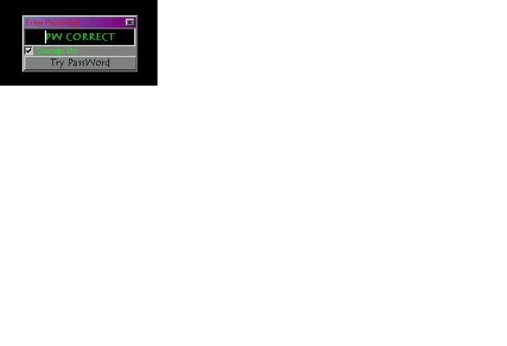



## u\-tech password protection

### Description

this code uses the registry to password protect your projects. it writes to the registry the correct password then reads from the registry to see if the user has entered the correct pasword.

after it does this it deletes the registry key so that the password can't be found by browsing the registry.

FeedBack welcome mailto: u_tech@excite.com
 
### More Info
 
'

             |
---                |---
**Submitted On**   |2001-02-16 13:05:36
**By**             |[underground technologies](https://github.com/Planet-Source-Code/PSCIndex/blob/master/ByAuthor/underground-technologies.md)
**Level**          |Advanced
**User Rating**    |5.0 (15 globes from 3 users)
**Compatibility**  |VB 5\.0, VB 6\.0
**Category**       |[Registry](https://github.com/Planet-Source-Code/PSCIndex/blob/master/ByCategory/registry__1-36.md)
**World**          |[Visual Basic](https://github.com/Planet-Source-Code/PSCIndex/blob/master/ByWorld/visual-basic.md)
**Archive File**   |[CODE\_UPLOAD151962192001\.zip](https://github.com/Planet-Source-Code/underground-technologies-u-tech-password-protection__1-21144/archive/master.zip)

